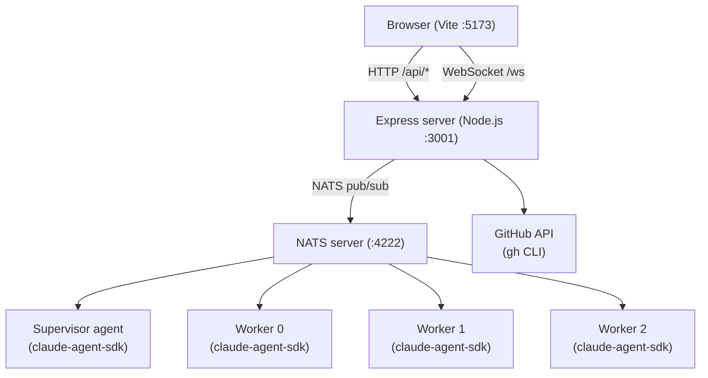

# Builder — Architecture

Builder is a single-page multi-agent build console. Given a GitHub repository
with open issues, it autonomously implements the issues using a team of Claude
Code agents coordinated over NATS.

## Process model



The browser talks to a Node.js Express server over HTTP and WebSocket. The
server runs four agent loops (one Supervisor, three Workers) in-process as
async iterators using `@anthropic-ai/claude-agent-sdk`. Agents communicate
via a local NATS server. The server streams all agent events to the browser
over a single WebSocket connection.

## File structure

```
src/
  server/                   — Node.js Express server (not bundled by Vite)
    index.ts                — Express + WebSocket server entrypoint (port 3001)
    nats.ts                 — NATS connection singleton
    agentPool.ts            — Spawns supervisor + worker agents, routes events
    runner.ts               — Adapted from Epik's runner.ts (no Electron)
    github.ts               — gh-CLI helpers: load issue graph, check PR status
    prompts/
      supervisor.ts         — Supervisor system prompt
      worker.ts             — Worker system prompt
  client/                   — React UI (bundled by Vite)
    types.ts                — AgentEvent, IssueNode, IssueGraph, PoolState, etc.
    theme.ts                — Palette, themes (dark/light)
    utils.ts                — unescapeJsonString
    chatReducer.ts          — Pure reducer for chat state
    App.tsx                 — Top-level layout: IssueGraph (top 50%) + AgentTabs (bottom 50%)
    IssueGraph.tsx          — Dependency graph visualisation (react-force-graph-2d)
    AgentTabs.tsx           — Tab strip: Supervisor + Worker 0/1/2
    ConsolePane.tsx         — Chat pane adapted from Epik's CodePane
    useAgentEvents.ts       — WebSocket hook: receives AgentEvent stream from server
```

## NATS topics

| Topic             | Direction    | Purpose                              |
|-------------------|--------------|--------------------------------------|
| `epik.supervisor` | → Supervisor | Assignments, CI reports, user input  |
| `epik.worker.0`   | → Worker 0   | Issue assignments, injected messages |
| `epik.worker.1`   | → Worker 1   | Issue assignments, injected messages |
| `epik.worker.2`   | → Worker 2   | Issue assignments, injected messages |
| `epik.log`        | → Server     | All agent events (for persistence)   |

## REST API

| Method | Path             | Description                                  |
|--------|------------------|----------------------------------------------|
| GET    | `/api/issues`    | Returns `IssueGraph` for `?repo=owner/repo`  |
| GET    | `/api/pool`      | Returns `PoolState` (agent statuses)         |
| POST   | `/api/start`     | Triggers supervisor's first NATS message     |
| POST   | `/api/message`   | Injects user message into named agent        |
| POST   | `/api/interrupt` | Interrupts named agent                       |
| WS     | `/ws`            | Streams `ServerMessage` envelopes to browser |

## Agent roles

### Supervisor

Receives the issue dependency graph on start. Works through issues in
dependency order, assigns idle workers, monitors CI and PR status, merges PRs,
closes issues, and declares done when all issues are closed. Communicates with
the server via the `nats_publish` custom tool.

### Workers (×3)

Each worker waits for an assignment on its NATS topic. On receipt it:

1. Checks out the repo into a temp directory.
2. Implements the issue following TDD (write tests first).
3. Runs `npm run lint` and `npm test` to verify.
4. Opens a PR and reports completion to `epik.supervisor` via `nats_publish`.

## Custom tool: `nats_publish`

Agents use a custom Claude Code tool `nats_publish` to send NATS messages:

```json
{
  "name": "nats_publish",
  "description": "Publish a message to a NATS topic",
  "input_schema": {
    "type": "object",
    "properties": {
      "topic": { "type": "string" },
      "message": { "type": "string" }
    },
    "required": ["topic", "message"]
  }
}
```

The runner intercepts `tool_use` events for `nats_publish`, publishes via
`nc.publish()`, and returns a synthetic tool result — never forwarding to
Claude Code's built-in tool dispatcher.

## Data types

### AgentEvent

Shared between server and browser. Identifies the kind of event:

```typescript
type AgentEvent =
  | { kind: 'text_delta'; text: string }
  | { kind: 'tool_use'; name: string; input: unknown }
  | { kind: 'tool_result'; content: unknown }
  | { kind: 'turn_end' }
  | { kind: 'error'; message: string }
  | { kind: 'inject'; text: string }
  | { kind: 'compaction'; summary: string }
```

### IssueGraph

```typescript
interface IssueNode {
  number: number
  title: string
  state: 'open' | 'closed'
  type: 'Feature' | 'Task' | 'Bug' | null
  external: boolean
  blockedBy: number[]
}

interface IssueGraph {
  nodes: IssueNode[]
}
```

### PoolState

```typescript
type WorkerRole = 'supervisor' | 'worker'
type WorkerStatus = 'idle' | 'busy'

interface WorkerState {
  id: AgentId
  role: WorkerRole
  status: WorkerStatus
  sessionId: string | undefined
}

type PoolState = WorkerState[]
```

### ServerMessage (WebSocket envelope)

```typescript
type AgentId = 'supervisor' | 'worker-0' | 'worker-1' | 'worker-2'

type ServerMessage =
  | { type: 'pool_state'; pool: PoolState }
  | { type: 'agent_event'; agentId: AgentId; event: AgentEvent }
```

## Development

### Prerequisites

- Node.js ≥ 20
- `nats-server` binary on PATH
- `gh` CLI authenticated

### Start

```bash
nats-server &        # start NATS
npm run dev          # Vite on :5173, Express on :3001
```

Open `http://localhost:5173/?repo=owner/repo`.

### Scripts

| Script                 | Description                                       |
|------------------------|---------------------------------------------------|
| `npm run dev`          | Vite dev server + Express via tsx (hot reload)    |
| `npm run server`       | Express server only (tsx watch)                   |
| `npm run build`        | Type-check + Vite frontend bundle + server bundle |
| `npm run build:server` | esbuild server bundle only → `dist/server.js`     |
| `npm run lint`         | ESLint                                            |
| `npm run format`       | Prettier                                          |
| `npm test`             | Vitest                                            |

### Build modes

**Development** (`npm run dev`): Vite serves the frontend with HMR on `:5173`.
The Express server runs from TypeScript source via `tsx watch` on `:3001`.

**Production** (`npm run build`): three sequential steps:

1. `tsc -b` — type-checks the whole project (no output files)
2. `vite build` — bundles the React frontend into `dist/`
3. `esbuild` — bundles the Express server into `dist/server.js`, leaving
   runtime dependencies (`express`, `ws`, `nats`, `@anthropic-ai/claude-agent-sdk`)
   as externals resolved from `node_modules`

**Docker** (`docker compose up --build`): runs the production build in a builder
stage, then copies only `dist/` into a lean production image. `.dockerignore`
excludes the host `node_modules` so the container always installs fresh
Linux-compatible binaries. Layer caching means `npm ci` and `gh` installation
only re-run when `package-lock.json` changes.

### Static file serving

In Docker the Express server serves the Vite frontend from `dist/` using the
`SERVE_STATIC` environment variable (set to `"1"` by the Dockerfile):

```ts
if (process.env['SERVE_STATIC']) {
  const distDir = resolve(fileURLToPath(import.meta.url), '..')
  app.use(express.static(distDir))
}
```

At runtime `import.meta.url` is `dist/server.js`, so `resolve(..., '..')` is
the `dist/` directory where Vite wrote `index.html` and `assets/`.

`SERVE_STATIC` is never set in development or tests. In tests this ensures the
static middleware is not registered regardless of whether a `dist/` directory
exists locally, preventing any test-ordering sensitivity to local build state.

## Reuse from Epik

| Epik source                   | Builder destination             | Changes                            |
|-------------------------------|---------------------------------|------------------------------------|
| `src/renderer/chatReducer.ts` | `src/client/chatReducer.ts`     | None                               |
| `src/renderer/theme.ts`       | `src/client/theme.ts`           | Drop `PersonaId` import            |
| `src/renderer/utils.ts`       | `src/client/utils.ts`           | None                               |
| `src/renderer/CodePane.tsx`   | `src/client/ConsolePane.tsx`    | Remove Mermaid; replace window.api |
| `src/agent/runner.ts`         | `src/server/runner.ts`          | Remove Electron; add nats_publish  |
| `src/agent/types.ts`          | `src/client/types.ts` (partial) | AgentEvent shape reused            |
